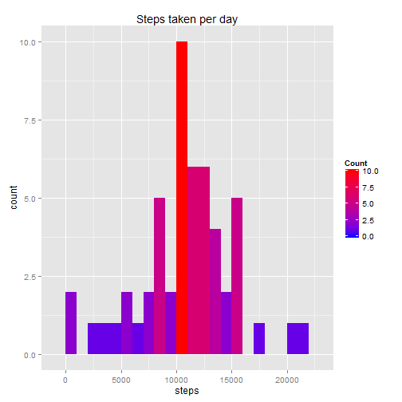
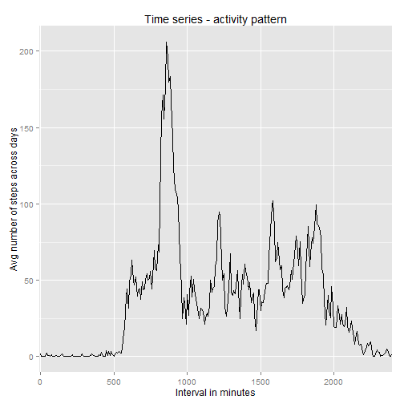
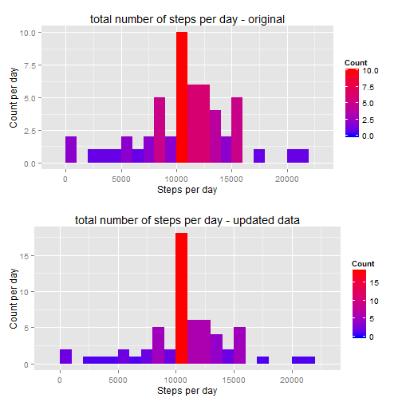
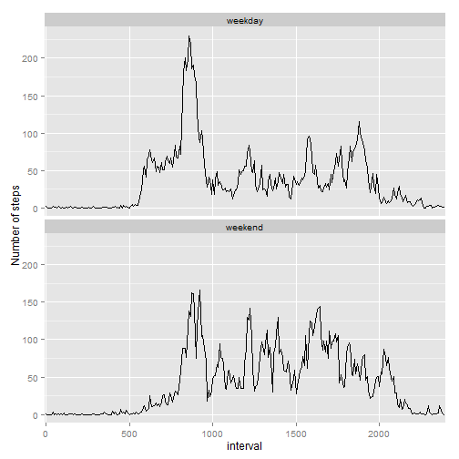

## Loading and preprocessing the data
### load required libraries

```r
		library(knitr)
		opts_chunk$set(echo = TRUE, results = 'hold')
		library (dplyr)
		library(plyr)
		library(ggplot2)
		library(lattice)
		library(gridExtra)
```
### Loading data

```r
	activity <- read.csv('activity.csv', header = TRUE, sep = ",",
                 colClasses=c("numeric", "character", "numeric"))  #read data
	activity$date <- as.Date(activity$date, format = "%Y-%m-%d")	#format date column	
	activity$interval <- as.factor(activity$interval)				#format interval column
```
	
## What is mean total number of steps taken per day?
### Calculate the total number of steps taken per day

```r
	TotalStepsPerDay <- aggregate(steps ~ date, data = activity, sum, na.rm = TRUE)
```
### Make a histogram of the total number of steps taken each day

```r
  ggplot(data = TotalStepsPerDay)+
  geom_histogram(mapping = aes(x = steps, fill= ..count..), 
                  stat = "bin", binwidth = 1000 )+
  scale_fill_gradient("Count", low = "blue", high = "red")+
  ggtitle("Steps taken per day")
```

 
### Calculate and report the mean and median of the total number of steps taken per day

```r
  mean(TotalStepsPerDay$steps, na.rm=T)
  median(TotalStepsPerDay$steps, na.rm=T)
```

```
## [1] 10766.19
## [1] 10765
```
### These formulas gives a mean and median of 10766.19 and 10765 respectively.
  
## What is the average daily activity pattern?
### Make a time series plot (i.e. type = "l") of the 5-minute interval (x-axis) and 
### the average number of steps taken, averaged across all days (y-axis)

```r
  meanSteps <- aggregate(activity$steps, 
                                  by = list(interval = activity$interval),
                                  FUN=mean, na.rm=TRUE)
  colnames(meanSteps) <- c("interval", "mean")
  ggplot(meanSteps, aes(x = interval, y = mean, group = 1)) + 
    geom_line() + scale_x_discrete(breaks = seq(0, 2500, 500))+
    ylab("Avg number of steps across days")+xlab("Interval in minutes")+
    ggtitle("Time series - activity pattern")
```

 
### Which 5-minute interval, on average across all the days in the dataset, contains the maximum number of steps?

```r
  max_interval <- meanSteps[which.max(meanSteps$mean),]
```
### The 5-minute interval that contains the maximum of steps, on average across all days, is 835.
	
## Imputing missing values
### Calculate and report the total number of missing values in the dataset 

```r
  sum(is.na(activity))
```

```
## [1] 2304
```
### The number of NA’s is 2304.
  
### Devise a strategy for filling in all of the missing values in the dataset

```r
  # Use means from the meanSteps table above
  activity_noNA <- cbind(activity, meanSteps)
  # replace NA in steps
  activity_noNA$steps[is.na(activity_noNA$steps)] <-activity_noNA$mean[is.na(activity_noNA$steps)] 
  # Create a new dataset that is equal to the original dataset but with the missing data filled in.
    activity_noNAFinal <- activity_noNA[, 1:3] 
```
	
### Make a histogram of the total number of steps taken each day  

```r
  TotalSteps <- aggregate(steps ~ date, data = activity_noNAFinal, sum)
  plot1 <- ggplot(data = TotalStepsPerDay)+
    geom_histogram(mapping = aes(x = steps, fill= ..count..), 
                   stat = "bin", binwidth = 1000 )+
    scale_fill_gradient("Count", low = "blue", high = "red")+
    xlab("Steps per day")+ylab("Count per day")+ggtitle("total number of steps per day - original")
  plot2 <- ggplot(data = TotalSteps)+
    geom_histogram(mapping = aes(x = steps, fill= ..count..), 
                   stat = "bin", binwidth = 1000 )+
    scale_fill_gradient("Count", low = "blue", high = "red")+
    xlab("Steps per day")+ylab("Count per day")+ggtitle("total number of steps per day - updated data")
  grid.arrange(plot1, plot2, nrow = 2)
```

 
### Calculate and report the mean and median total number of steps taken per day.
  
  ```r
  mean(TotalSteps$steps, na.rm=T) 
  median(TotalSteps$steps, na.rm=T) 
  ```
  
  ```
  ## [1] 10766.19
  ## [1] 10766.19
  ```
### These formulas gives a mean and median of 10766.19 and 10766.19 respectively. The median differs from the original value.

## Are there differences in activity patterns between weekdays and weekends?
### Create a new factor variable in the dataset with two levels – “weekday” and “weekend”

```r
  activity2 <- activity_noNAFinal # copy of filled table
  activity2$day<- weekdays(activity2$date)
  activity2 <- cbind(activity2, 
                        daytype=ifelse(activity2$day == "Saturday" | 
                                         activity2$day == "Sunday", "weekend", 
                                       "weekday"))
```
### Make a panel plot containing a time series plot

```r
  weekdayactivity <- subset(activity2, daytype == "weekday")
  weekendactivity <- subset(activity2, daytype == "weekend")
  weekdayAvg <- aggregate(weekdayactivity$steps, list(weekdayactivity$interval,weekdayactivity$daytype), mean)
  weekendAvg <- aggregate(weekendactivity$steps, list(weekendactivity$interval,weekendactivity$daytype), mean)
  colnames(weekdayAvg) <- c("interval", "daytype", "avg_steps")
  colnames(weekendAvg) <- c("interval", "daytype", "avg_steps")
  totaldata <- rbind(weekendAvg,weekdayAvg)
  ggplot(totaldata, aes(x=interval, y=avg_steps, group=1)) + geom_line() + 
    scale_x_discrete(breaks=seq(0,2500,500)) + 
    facet_wrap(~ daytype, nrow=2) + 
    ylab("Number of steps")
```

 

### As seen in graphs above there is a difference in activity pattern between weekdays and weekends and could correspond to work routine patterns.
